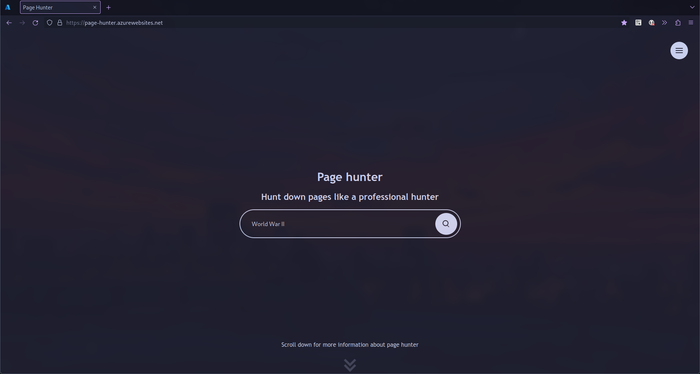
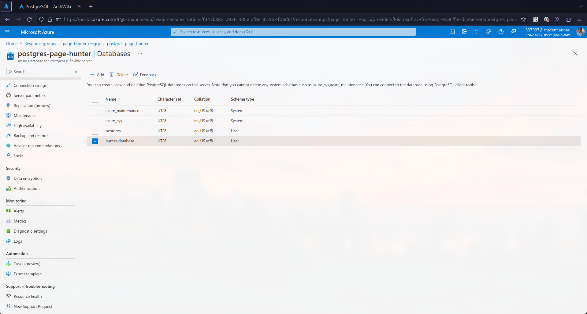

#   Page Hunter
##  Introduction
Page hunter is a privacy focused, open-source search engine built with typescript, express, postgres and ejs.

##  Screenhots
### Demonstration

<em>Landing page for Page Hunter</em>

<em>Sample search for "World War II"</em>

<em>Results for "World War II"</em>

---

### Azure Resource Group

<em>Azure resource group for "Page Hunter"</em>

### Azure -- App Service

<em>Azure App Service for "Page Hunter"</em>

<em>Azure App Service Deployments for "Page Hunter"</em>

### Azure - PostgresSQL Database

<em>Azure PostgreSQL (PostgreSQL Flexible Server) "Page Hunter"</em>

<em>Azure PostgreSQL Databases in "Page Hunter"</em>

### Azure - Virtual Network

<em>Azure Virtual Network for "Page Hunter"</em>

<em>Azure Virtual Network subnets for "Page Hunter"</em>

